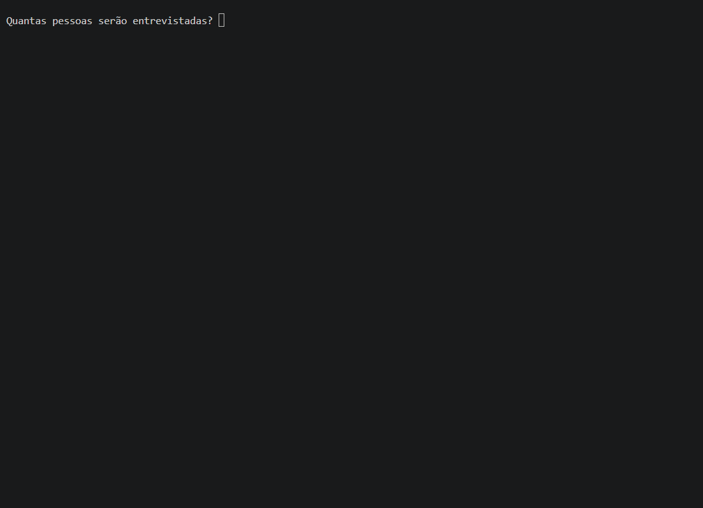

# 📊 Pesquisa de Satisfação

Programa desenvolvido em **Python** para realizar uma pesquisa de satisfação.

## 📝 Sobre o projeto

O programa pergunta a quantidade de pessoas que serão entrevistadas e registra:

* 👤 Nome
* 🎂 Idade
* ⭐ Opinião sobre o atendimento

As opções são:

1. ⭐ Excelente
2. 👍 Bom
3. 👎 Ruim

Ao final, o programa mostra a quantidade de respostas de cada opção.

Também é possível realizar uma nova pesquisa ou finalizar o programa.
## 📺 Demonstração com 10 entrevistados

## 💻 Tecnologias

* 🐍 Python

## 🧠 Conceitos utilizados

* `if`, `elif` e `else`
* `for`
* `while`
* `break`
* `input()`
* Variáveis e contadores

## 👤 Autor
Renan Henricson

